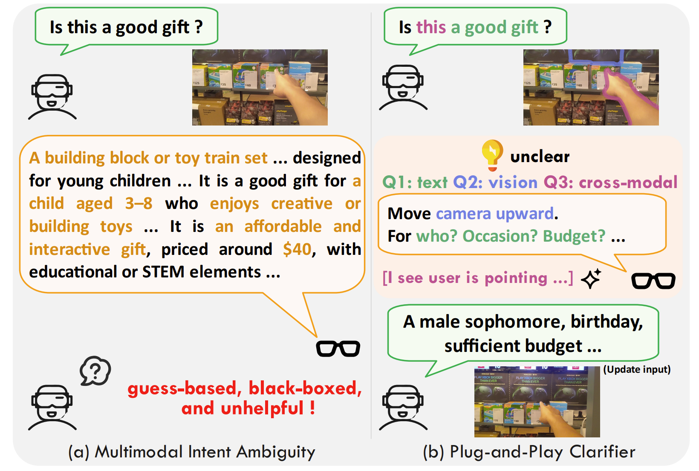
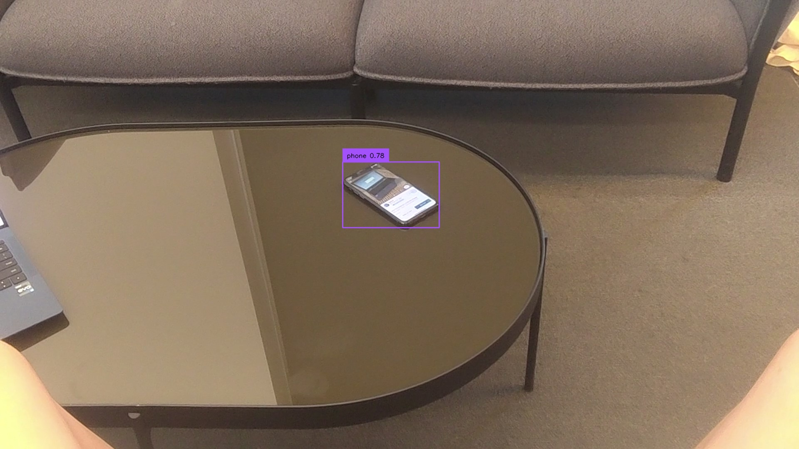
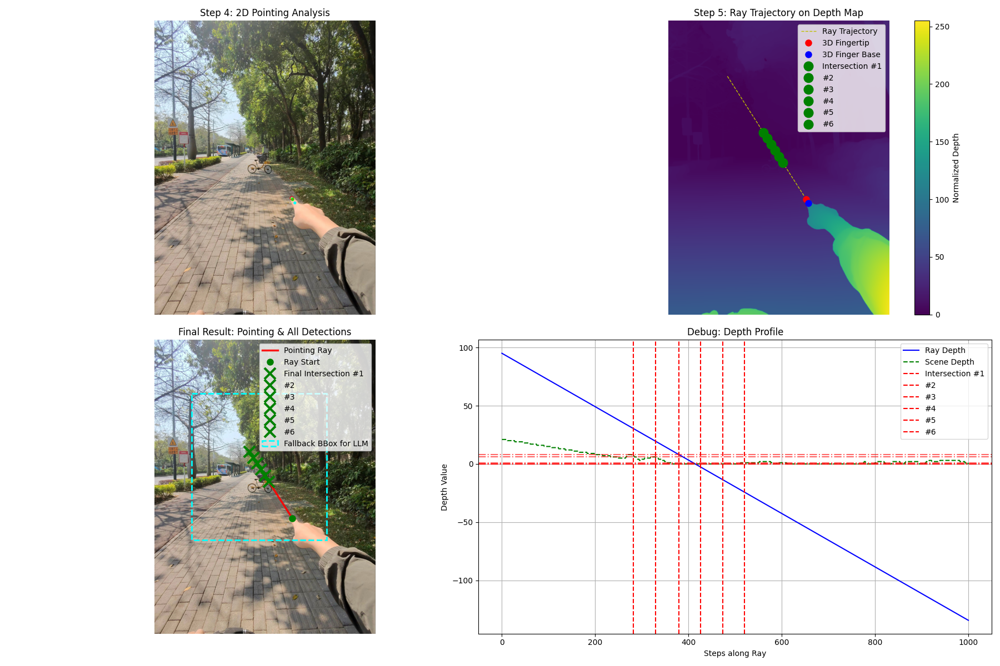
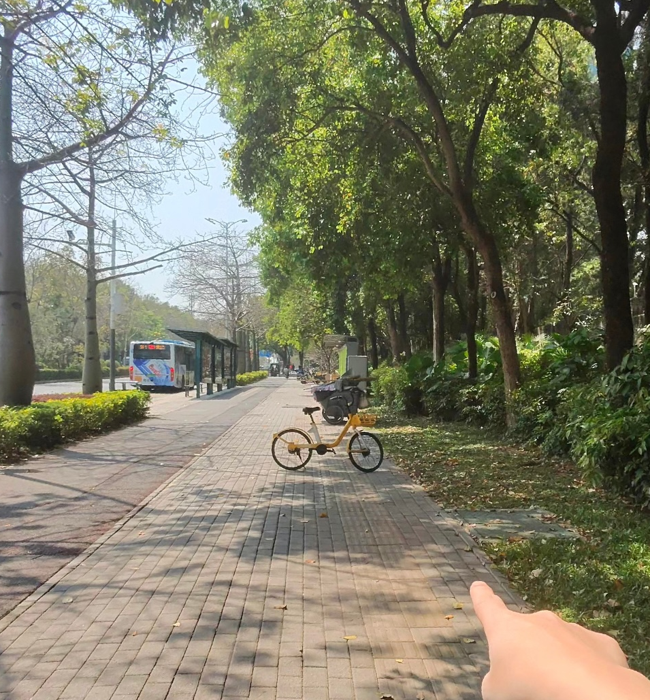
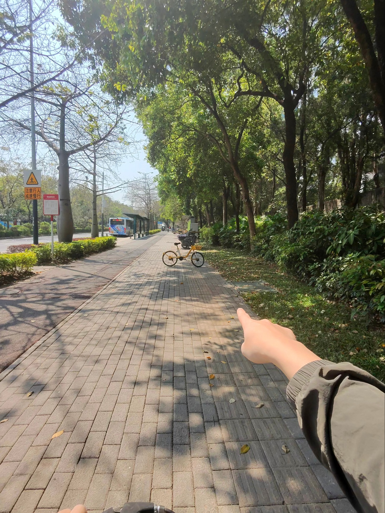

# Plug-and-Play Clarifier: A Zero-Shot Multimodal Framework for Egocentric Intent Disambiguation

Code for the AAAI 2026 paper **“Plug-and-Play Clarifier: A Zero-Shot Multimodal Framework for Egocentric Intent Disambiguation”**.

📄 Paper (arXiv): [https://arxiv.org/pdf/2511.08971](https://arxiv.org/pdf/2511.08971)

🎬 Demo Video (YouTube): [https://www.youtube.com/shorts/yIeMgfe4Kc4](https://www.youtube.com/shorts/yIeMgfe4Kc4)

📺 Video (Bilibili): [https://www.bilibili.com/video/BV1mtC4BcEWA/](https://www.bilibili.com/video/BV1mtC4BcEWA/)

<p align="center">
  
</p>

This repository provides three plug-and-play clarification modules:

1. **Text-based Clarifier** – multi-turn question asking for vague language instructions.
2. **Image-based Clarifier** – feedback on object visibility and framing in images.
3. **Cross-modal Clarifier** – pointing gesture disambiguation with 2D–3D reasoning.

---

## Environment

Tested on:

* **NVIDIA H200**, CUDA 12.4
* **NVIDIA GeForce RTX 4090**, CUDA 12.2

Other modern GPUs should also work.

---

## 0. Installation

```bash
# clone this repo
git clone https://github.com/YoungSeng/plug-and-play-clarifier
cd plug-and-play-clarifier

# create environment
conda create -n clarifier python=3.10
conda activate clarifier

# common dependencies
pip install transformers torch accelerate cprint
```

Each sub-module has extra dependencies; see sections below.

---


## 1. Text-based Clarifier

All examples use `Qwen/Qwen2.5-7B-Instruct` as the base model.
You can replace it with any other model (e.g., from Hugging Face) via `--model_name_or_path`.

### 1.1 Setup

```bash
cd text-based
git clone https://github.com/OpenBMB/Tell_Me_More
```

Make sure the dataset (e.g. `IN3/test.jsonl`) is inside `./Tell_Me_More/data/IN3/`.

### 1.2 Usage (Evaluation Mode with User Simulator)

The script can be run in:

* **Interactive mode** (live testing)
* **Evaluation mode** (automated dataset testing with a user simulator)

Example: run evaluation with LLM-powered user simulator:

```bash
python main_clarifier.py \
  --model_name_or_path "Qwen/Qwen2.5-7B-Instruct" \
  --data_dir "./Tell_Me_More/data/IN3/test.jsonl" \
  --output_dir "./output" \
  --eval_mode
```

Key arguments:

* `--eval_mode`: activates the LLM user simulator.
* `--data_dir`: path to your test data (`.jsonl`).
* `--output_dir`: directory to save conversation logs.

[//]: # (
python main_clarifier.py --model_name_or_path "Qwen/Qwen2.5-7B-Instruct" --data_dir "../../Tell_Me_More/data/IN3/test.jsonl" --output_dir "./output" --eval_mode
)

### 1.3 Metrics

We use an LLM to compute **“Lv3 missing details cover rate”** and other statistics.

```bash
# (optional) change --model_name_or_path to another model
#   e.g. "Qwen/Qwen3-8B-AWQ" or a local path

python analyze_conversations.py \
  --model_name_or_path "Qwen/Qwen2.5-7B-Instruct" \
  --output_dir "./output" \
  --input_file "./output/eval_output_Qwen_Qwen2.5-7B-Instruct.jsonl"

python evaluate_metrics.py \
  --model_name_or_path "Qwen/Qwen2.5-7B-Instruct" \
  --input_split_file "./output/eval_output_Qwen_Qwen2.5-7B-Instruct_split.jsonl" \
  --human_ref_file "./Tell_Me_More/data/data_labeling/test_data_report_mix.jsonl" \
  --output_dir "./output"
```

[//]: # (
python analyze_conversations.py --model_name_or_path "/mnt/data_3/home_aiglasses/Qwen2.5-7B-Instruct/" --output_dir "./output" --input_file "./output/eval_output_Qwen2.5-7B-Instruct.jsonl"
python evaluate_metrics.py --model_name_or_path "Qwen/Qwen3-8B-AWQ" --input_split_file "/home/sicheng/Desktop/mycode/Plug-and-Play_Clarifier/eval_output_Qwen2.5-7B-Instruct_split.jsonl" --human_ref_file "../../Tell_Me_More/data/data_labeling/test_data_report_mix.jsonl" --output_dir "./output"
)

Example results (on our setup):

* **Vagueness judgement accuracy**: `0.8056`
* **Average conversation rounds**: `3.9722`
* **Lv3 missing details cover rate**:

  * `0.5095` – Qwen2.5-7B-Instruct
  * `0.5701` – Qwen2.5-7B-Instruct-AWQ
  * `0.5852` – Qwen3-8B-AWQ

To reproduce paper-reported numbers, please use **GPT-4** as the evaluation model.
Due to sampling-based inference, results may slightly vary across runs.

---

## 2. Image-based Clarifier

### 2.1 Object Name Extraction

This module uses an LLM to extract a single key object name from a user prompt.
The output is a clean, lowercase English string representing a visually detectable object.

```bash
cd image-based

python object_extractor.py \
  --model_name_or_path "Qwen/Qwen2.5-7B-Instruct" \
  --prompt "Please analyze the current state of this Chinese chess game."
```

[//]: # (python object_extractor.py --model_name_or_path "/mnt/data_3/home_aiglasses/models--Qwen--Qwen2.5-7B-Instruct-AWQ/snapshots/b25037543e9394b818fdfca67ab2a00ecc7dd641/" --prompt "Tell me about this calendar.")

Example:

```text
Input Prompt: 'Please analyze the current state of this Chinese chess game.'
Extracted Object: 'chessboard'

Input Prompt: "Tell me about this calendar."
Extracted Object: 'calendar'
```

### 2.2 Image Feedback Generation

This module analyzes images and generates feedback on object visibility (position, size, and clarity), using an object detector to locate the target.

#### 2.2.1 Install GroundingDINO

```bash
git clone https://github.com/IDEA-Research/GroundingDINO.git
cd GroundingDINO
pip install -e .

mkdir weights
cd weights
wget -q https://github.com/IDEA-Research/GroundingDINO/releases/download/v0.1.0-alpha/groundingdino_swint_ogc.pth
cd ../..
```

#### 2.2.2 Dataset

Download the dataset **`Image_based_v0_2`** (part of the `plug-and-play-clarifier-dataset` package) and place it under:

You can obtain the dataset from any of the following mirrors:

* **Tsinghua Cloud**: [https://cloud.tsinghua.edu.cn/d/f17bd12696a44a81afe3/](https://cloud.tsinghua.edu.cn/d/f17bd12696a44a81afe3/)
* **Baidu Netdisk**: [https://pan.baidu.com/s/1dEolLM07uY4IzDS1fgWPcg](https://pan.baidu.com/s/1dEolLM07uY4IzDS1fgWPcg)
  Extraction code: `8xpt`
* **Google Drive**: [https://drive.google.com/drive/folders/1rtI-HiopyiBPP0SOxHdzeUqiAxnt6Crq?usp=drive_link](https://drive.google.com/drive/folders/1rtI-HiopyiBPP0SOxHdzeUqiAxnt6Crq?usp=drive_link)


```text
image-based/
  dataset/
    Image_based_v0_2/
      image_clarity_dataset.xlsx
      ...
```

#### 2.2.3 Run

```bash
cd image-based
mkdir -p output

pip install pandas openpyxl

python image_feedback_generator.py \
  --input_excel "./dataset/Image_based_v0_2/image_clarity_dataset.xlsx" \
  --output_excel "./output/ours_model_results_with_viz_dino.xlsx" \
  --model_type "GroundingDINO" \
  --model_path "./GroundingDINO/weights/groundingdino_swint_ogc.pth" \
  --config_path "./GroundingDINO/groundingdino/config/GroundingDINO_SwinT_OGC.py" \
  --visualize \
  --viz_dir "output_visuals"
```

**Optional (with timing recorder):**

```bash
python image_feedback_generator_timing_test.py \
  --input_excel "./dataset/Image_based_v0_2/image_clarity_dataset.xlsx" \
  --output_excel "./output/ours_model_results_with_viz_dino.xlsx" \
  --model_type "GroundingDINO" \
  --model_path "./GroundingDINO/weights/groundingdino_swint_ogc.pth" \
  --config_path "./GroundingDINO/groundingdino/config/GroundingDINO_SwinT_OGC.py" \
  --visualize \
  --viz_dir "output_visuals" \
  --enable_timing
```

> 💡 The first run will automatically download `bert-base-uncased` (~440MB), so please be patient.

**Potential issues:**

* `TypeError: annotate() got an unexpected keyword argument 'labels'`
  → See Grounded-Segment-Anything [issue #515](https://github.com/IDEA-Research/Grounded-Segment-Anything/issues/515).
* `NameError: name '_C' is not defined`
  → Try `pip install groundingdino-py` (see [issue #230](https://github.com/IDEA-Research/GroundingDINO/issues/230)) or reinstall GroundingDINO in a fresh env (see [official docs](https://github.com/IDEA-Research/GroundingDINO)).

Annotated images will be saved in `output_visuals/`, for example:

<p align="center">
  
</p>


[//]: # (cp -r "/home/sicheng/Desktop/mycode/Plug-and-Play_Clarifier/GroundingDINO/" /home/sicheng/Desktop/mycode/AAAI-2026-paper-1/image-based/)

[//]: # (python image_feedback_generator.py --input_excel "/mnt/data_3/home_aiglasses/vision-intention-dataset/v0_2/image_clarity_dataset_copy.xlsx" --output_excel "/mnt/data_3/home_aiglasses/vision-intention-dataset/v0_2/ours_model_results_with_viz_dino_copy.xlsx" --model_type "GroundingDINO" --model_path "/mnt/data_3/home_aiglasses/groundingdino_swint_ogc.pth" --config_path "GroundingDINO/groundingdino/config/GroundingDINO_SwinT_OGC.py" --visualize --viz_dir "output_visuals")

### 2.3 Metrics

```bash
python evaluate_model.py \
  --input "./output/ours_model_results_with_viz_dino.xlsx" \
  --output "./output/evaluation_results_ours_model_dino_final.xlsx"
```

Example output:

```text
Successfully read 510 records from: ./output/ours_model_results_with_viz_dino.xlsx
Evaluating model: 'Ours' Model

--- 'Ours' Model Evaluation Summary ---
Total Samples: 510
Perfect Matches (1.0 pt): 391 (76.67%)
Partial Matches (0.5 pt): 34 (6.67%)
Incorrect Matches (0.0 pt): 85 (16.67%)
-------------------------
Strict Accuracy: 76.67%
Loose Accuracy: 83.33%
Average Score: 0.8000
----------------------------------

Evaluation complete! Results saved to: ./output/evaluation_results_ours_model_dino_final.xlsx
```

[//]: # (python evaluate_model.py --input "/mnt/data_3/home_aiglasses/vision-intention-dataset/v0_2/ours_model_results_with_viz_dino_copy.xlsx" --output "/mnt/data_3/home_aiglasses/vision-intention-dataset/v0_2/evaluation_results_ours_model_dino_final_copy.xlsx")

---

## 3. Cross-modal Clarifier (Pointing Referential Clarification)

This module resolves pointing gestures in egocentric images via 3D reasoning (depth estimation, pose detection, segmentation, and LLM-based reasoning).

### 3.1 Install Depth-Anything-V2

```bash
cd cross-modal-based
git clone https://github.com/DepthAnything/Depth-Anything-V2
```

Download the [pretrained model](https://huggingface.co/depth-anything/Depth-Anything-V2-Large/resolve/main/depth_anything_v2_vitl.pth) and put it at:

```text
./Depth-Anything-V2/checkpoints/depth_anything_v2_vitl.pth
```

### 3.2 Dataset

Place the **`Cross_modal_based_v0_5`** split (also included in the `plug-and-play-clarifier-dataset` package) and place it under:

```text
cross-modal-based/
  dataset/
    Cross_modal_based_v0_5/
      new_500_label.xlsx
      new_500/
        *.png / *.jpg
```

### 3.3 Run

```bash
cd cross-modal-based

pip install ultralytics
pip install qwen-vl-utils[decord]==0.0.8

python run_pointing_analysis.py \
  --llm_model_name_or_path "Qwen/Qwen2.5-VL-7B-Instruct" \
  --excel_input_path "./dataset/Cross_modal_based_v0_5/new_500_label.xlsx" \
  --excel_image_dir "./dataset/Cross_modal_based_v0_5/new_500" \
  --excel_output_path "ours_answers.xlsx"
```

**Optional (with timing recorder):**

```bash
python run_pointing_analysis_timing_test.py \
  --llm_model_name_or_path "Qwen/Qwen2.5-VL-7B-Instruct" \
  --excel_input_path "./dataset/Cross_modal_based_v0_5/new_500_label.xlsx" \
  --excel_image_dir "./dataset/Cross_modal_based_v0_5/new_500" \
  --excel_output_path "ours_answers.xlsx" \
  --enable_timing
```

[//]: # (cp -r "/home/sicheng/Desktop/mycode/Plug-and-Play_Clarifier/Depth-Anything-V2/" /home/sicheng/Desktop/mycode/AAAI-2026-paper-1/cross-modal-based/)

[//]: # (python run_pointing_analysis.py --llm_model_name_or_path "/mnt/data_3/home_aiglasses/models--Qwen--Qwen2.5-VL-7B-Instruct/snapshots/cc594898137f460bfe9f0759e9844b3ce807cfb5/" --excel_input_path "/mnt/data_3/home_aiglasses/pointing-dataset/Processed/matched_annotations_copy.xlsx" --excel_image_dir "/mnt/data_3/home_aiglasses/pointing-dataset/Processed/MatchedSamples/" --excel_output_path "/mnt/data_3/home_aiglasses/pointing-dataset/Processed/ours_answers_copy.xlsx")

During the first run you should see logs like:

```text
--- Loading all local vision models... ---
  > Depth model loaded: ./Depth-Anything-V2/checkpoints/depth_anything_v2_vitl.pth
  > Pose model loaded: yolo11n-pose.pt
  > YOLOE Seg model loaded: yoloe-11l-seg.pt
  > YOLOE Prompt-Free model loaded: yoloe-11l-seg-pf.pt
--- All local models loaded successfully ---

==================== Processing Sample [1/500] | ID: 0 ====================
--- [3D Intersection Mode] Analyzing ray-scene collision ---
[+] Unified result image saved to 'pipeline_results/0_result.png'
  -> Final Answer: Your finger is pointing at the yellow bicycle parked on the right side of the path.
```

You will find:

* Full pipeline visualizations in `pipeline_results/`
* Cropped LLM inputs in `llm_cropped_input/`

Example:

<p align="center">
  
</p>

<p align="center">
  
</p>

### 3.4 Metrics

```bash
python unified_scorer.py \
  --gpt_answer_path "./ours_answers.xlsx" \
  --standard_path "./dataset/Cross_modal_based_v0_5/new_500_label.xlsx" \
  --output_path "./qwen_scored_results.xlsx" \
  --scorer "qwen" \
  --model_name_or_path "Qwen/Qwen2.5-7B-Instruct"
```

Example:

```text
✅ Scoring complete. Results saved to: ./qwen_scored_results.xlsx
📊 Average score for the model: 0.6040
```

[//]: # (python unified_scorer.py --gpt_answer_path "/mnt/data_3/home_aiglasses/pointing-dataset/Processed/ours_answers_copy.xlsx" --standard_path "/mnt/data_3/home_aiglasses/pointing-dataset/Processed/matched_annotations_copy.xlsx" --output_path "/mnt/data_3/home_aiglasses/pointing-dataset/Processed/pointing_gesture_scored_answers_ours.xlsx" --scorer "gpt" --model_name_or_path "gpt-4o")

[//]: # (python unified_scorer.py --gpt_answer_path "/mnt/data_3/home_aiglasses/pointing-dataset/Processed/ours_answers_copy.xlsx" --standard_path "/mnt/data_3/home_aiglasses/pointing-dataset/Processed/matched_annotations_copy.xlsx" --output_path "/mnt/data_3/home_aiglasses/pointing-dataset/Processed/pointing_gesture_scored_answers_ours.xlsx" --scorer "qwen" --model_name_or_path "/mnt/data_3/home_aiglasses/models--Qwen--Qwen2.5-14B-Instruct-AWQ/snapshots/539535859b135b0244c91f3e59816150c8056698/")

Or use "gpt-4o":

```bash
python unified_scorer.py --gpt_answer_path "/path/to/your/model_answers.xlsx" --standard_path "/path/to/your/standard_answers.xlsx" --output_path "/path/to/your/gpt4o_scored_results.xlsx" --scorer "gpt" --model_name_or_path "gpt-4o"
```

---

## 4. (Optional) Baselines

### 4.1 Text-based Baselines

```bash
cd text-based/baselines

# Full dataset run
CUDA_VISIBLE_DEVICES=0 python run-text-based-baseline.py \
  --agent_model_name_or_path "Qwen/Qwen2.5-7B-Instruct-AWQ" \
  --simulator_model_name_or_path "Qwen/Qwen2.5-14B-Instruct-AWQ" \
  --data_dir "../../../Tell_Me_More/data/IN3/test.jsonl" \
  --eval_mode

# Single inference (Mistral-Interact)
CUDA_VISIBLE_DEVICES=0 python single_inference.py \
  --model_name "Mistral-Interact" \
  --model_name_or_path "../../../Tell_Me_More/models/MI-mc/"
```

[//]: # (CUDA_VISIBLE_DEVICES=0 python run-text-based-baseline.py --agent_model_name_or_path "/mnt/data_3/home_aiglasses/models--Qwen--Qwen2.5-7B-Instruct-AWQ/snapshots/b25037543e9394b818fdfca67ab2a00ecc7dd641/" --simulator_model_name_or_path "/mnt/data_3/home_aiglasses/models--Qwen--Qwen2.5-7B-Instruct-AWQ/snapshots/b25037543e9394b818fdfca67ab2a00ecc7dd641/" --data_dir "../../../Tell_Me_More/data/IN3/test.jsonl" --eval_mode)
[//]: # (CUDA_VISIBLE_DEVICES=0 python single_inference.py --model_name "Mistral-Interact" --model_name_or_path '../../../Tell_Me_More/models/MI-mc/')

### 4.2 Image-based Baselines (GPT-4 Vision)

```bash
export OPENAI_API_KEY="sk-your-key-here"

cd image-based

python -m baseline.run_gpt_vision \
  --input-excel "./dataset/Image_based_v0_2/image_clarity_dataset.xlsx" \
  --output-excel "./dataset/Image_based_v0_2/image_clarity_baseline_results.xlsx"

# evaluation
python evaluate_model.py \
  --input "./dataset/Image_based_v0_2/image_clarity_baseline_results.xlsx" \
  --output "./output/evaluation_results_ours_model_dino_final_baseline.xlsx"
```

Example evaluation:

```text
--- GPT-4 Baseline Evaluation Summary ---
Total Samples: 510
Perfect Matches (1.0 pt): 132 (25.88%)
Partial Matches (0.5 pt): 89 (17.45%)
Incorrect Matches (0.0 pt): 289 (56.67%)
-------------------------
Strict Accuracy: 25.88%
Loose Accuracy: 43.33%
Average Score: 0.3461
------------------------------------
```

### 4.3 Cross-modal Baselines (VQA)

```bash
cd cross-modal-based/baseline

# GPT-4o baseline
python run_vqa_baseline.py \
  --baseline "gpt" \
  --data_path "/path/to/your/matched_annotations.xlsx" \
  --image_dir "/path/to/your/MatchedSamples/" \
  --output_path "/path/to/your/results/gpt4o_answers.xlsx" \
  --model_name_or_path "gpt-4o"

# Qwen-VL baseline
python run_vqa_baseline.py \
  --baseline "qwen" \
  --data_path "../dataset/Cross_modal_based_v0_5/new_500_label.xlsx" \
  --image_dir "../dataset/Cross_modal_based_v0_5/new_500/" \
  --output_path "./qwen_answers.xlsx" \
  --model_name_or_path "Qwen/Qwen2.5-VL-7B-Instruct" \
  --device "cuda:0"
```

Example (for the above figure):

<p align="center">
  
</p>

```
# gpt-4o
✅ Answer: Your finger is pointing at a bicycle on the path.
# Qwen
✅ Answer: The finger in the image is pointing towards a yellow bicycle that is parked on the sidewalk to the right of the path. The bicycle appears to be a shared or rental bike, as indicated by its design and placement.
```

Evaluation:

```bash
cd ..
python unified_scorer.py \
  --gpt_answer_path "./baseline/qwen_answers.xlsx" \
  --standard_path "./dataset/Cross_modal_based_v0_5/new_500_label.xlsx" \
  --output_path "./qwen_scored_results_baselines.xlsx" \
  --scorer "qwen" \
  --model_name_or_path "Qwen/Qwen2.5-7B-Instruct"
```

Example:

```text
✅ Scoring complete. Results saved to: ./qwen_scored_results_baselines.xlsx
📊 Average score for the model: 0.5903
```

[//]: # (python run_vqa_baseline.py --baseline "gpt" --data_path "/mnt/data_3/home_aiglasses/pointing-dataset/Processed/matched_annotations_copy.xlsx" --image_dir "/mnt/data_3/home_aiglasses/pointing-dataset/Processed/MatchedSamples/" --output_path "/mnt/data_3/home_aiglasses/pointing-dataset/Processed/gpt-4o_answers_copy.xlsx" --model_name_or_path "gpt-4o")

[//]: # (python run_vqa_baseline.py --baseline "qwen" --data_path "/mnt/data_3/home_aiglasses/pointing-dataset/Processed/matched_annotations_copy.xlsx" --image_dir "/mnt/data_3/home_aiglasses/pointing-dataset/Processed/MatchedSamples/" --output_path "/mnt/data_3/home_aiglasses/pointing-dataset/Processed/qwen_vl_2.5_answers_copy.xlsx" --model_name_or_path "/mnt/data_3/home_aiglasses/models--Qwen--Qwen2.5-VL-7B-Instruct/snapshots/cc594898137f460bfe9f0759e9844b3ce807cfb5/" --device "cuda:0")

---

## 5. Notes on Datasets & Reproducibility

The **Image-based** and **Cross-modal** results here may differ slightly from those reported in the paper.
A substantial portion of the original dataset cannot be released due to privacy and third-party licensing constraints.
Therefore, the public evaluation is conducted on **updated, publicly shareable subsets** to ensure reproducibility under open conditions.

## 6. Citation

If you find this repository useful, please consider citing our paper:

```bibtex
@inproceedings{yang2026plugandplayclarifier,
  title     = {Plug-and-Play Clarifier: A Zero-Shot Multimodal Framework for Egocentric Intent Disambiguation},
  author    = {Yang, Sicheng and Huang, Yukai and Cai, Weitong and Sun, Shitong and He, You and Deng, Jiankang and Zhang, Hang and Song, Jifei and Zhang, Zhensong},
  booktitle = {Proceedings of the AAAI Conference on Artificial Intelligence},
  year      = {2026},
  note      = {To appear}
}
````


